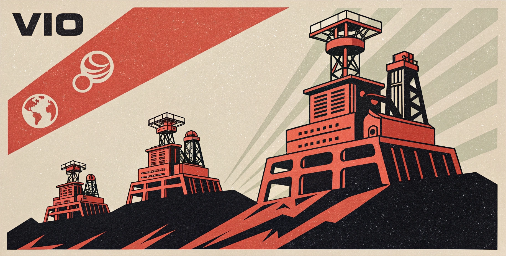

# vIO - viteImageOptimizer



> The lightning-fast Vite image optimizer that makes your images skinny and your builds snappy

[](https://badge.fury.io/js/@olwiba%2Fvio)
[](https://www.npmjs.com/package/@olwiba/vio)
[](https://opensource.org/licenses/MIT)

**vIO** is a zero-config Vite plugin that automatically optimizes your images during build time. It's fast, smart, and comes with delightful terminal output that actually makes you want to look at your build logs.

## Features

- 🚀 **Zero Config** - Works out of the box with sensible defaults
- 🖼️ **Multi-Format Support** - JPG, PNG, WebP, SVG, and GIF
- ⚡ **Lightning Fast** - Optimizes only changed files with smart caching
- 🎨 **Beautiful Output** - Colorful, timestamped logs that don't suck
- 📊 **Detailed Stats** - See exactly how much space you saved
- 🔄 **Smart Caching** - Skip files that are already optimized and up-to-date
- 🌳 **Recursive Processing** - Handles nested directory structures
- 📦 **Tiny Bundle** - Minimal footprint, maximum impact

## Results That Matter

```bash
[12:34:56 PM] [vIO] 🖼️  Processing images...
[12:34:57 PM] [vIO] hero-image.jpg  -67.2%    2.1 MB ⭢  0.7 MB
[12:34:58 PM] [vIO] product-gallery.png  -45.8%    890.3 kB ⭢  483.2 kB
[12:34:59 PM] [vIO] icons/logo.svg  -12.4%    45.6 kB ⭢  39.9 kB

[12:34:59 PM] [vIO] 💰 total savings = 1.5MB/3.1MB ≈ 48.7%
```

## 🚀 Quick Start

### Installation

```bash
npm install @olwiba/vio --save-dev
# or
bun add @olwiba/vio -D
# or
yarn add @olwiba/vio -D
# or
pnpm add @olwiba/vio -D
```

### Basic Usage

```typescript
// vite.config.ts
import { defineConfig } from "vite";
import { viteImageOptimizer } from "@olwiba/vio";

export default defineConfig({
  plugins: [
    viteImageOptimizer({
      inputPath: "src/assets/images",
      outputPath: "dist/images",
      quality: 80,
    }),
  ],
});
```

That's it! Your images will be automatically optimized during build.

## Configuration

```typescript
interface ViteImageOptimizerOptions {
  inputPath: string; // Source directory for images
  outputPath: string; // Where optimized images go
  quality?: number; // Compression quality (1-100, default: 80)
}
```

### Examples

**Minimal Setup:**

```typescript
viteImageOptimizer({
  inputPath: "public/images",
  outputPath: "dist/optimized",
});
```

**High Quality:**

```typescript
viteImageOptimizer({
  inputPath: "src/assets",
  outputPath: "public/optimized",
  quality: 95,
});
```

**Development vs Production:**

```typescript
viteImageOptimizer({
  inputPath: "assets/images",
  outputPath: "dist/images",
  quality: process.env.NODE_ENV === "production" ? 75 : 90,
});
```

## Smart Features

### Intelligent Caching

vIO only processes images that have changed since the last build. If your source image hasn't been modified, we skip it entirely - making subsequent builds lightning fast.

### Multi-Format Support

- **JPEG/JPG** - Compressed with configurable quality
- **PNG** - Optimized while preserving transparency
- **WebP** - Modern format with excellent compression
- **SVG** - Minified using SVGO with multipass optimization
- **GIF** - Compressed while maintaining animation

### Directory Structure Preservation

Your folder structure stays exactly the same. If you have `images/gallery/photo1.jpg`, it becomes `dist/images/gallery/photo1.jpg`.

## 🛠️ Advanced Usage

### With Vite Aliases

```typescript
export default defineConfig({
  resolve: {
    alias: {
      "@images": path.resolve(__dirname, "dist/images"),
    },
  },
  plugins: [
    viteImageOptimizer({
      inputPath: "src/images",
      outputPath: "dist/images",
    }),
  ],
});
```

Then use in your code:

```typescript
import heroImage from "@images/hero.jpg";
```

### Multiple Input Directories

```typescript
export default defineConfig({
  plugins: [
    viteImageOptimizer({
      inputPath: "src/assets/images",
      outputPath: "dist/images",
    }),
    viteImageOptimizer({
      inputPath: "public/gallery",
      outputPath: "dist/gallery",
    }),
  ],
});
```

## 🤝 Contributing

We love contributions! Check out our [Contributing Guide](CONTRIBUTING.md) to get started.

### Development Setup

```bash
git clone https://github.com/olwiba/vIO.git
cd vIO
npm install
npm run dev
```

### Running Tests

```bash
npm test
npm run test:watch
```

## License

MIT © [Ollie Bannister](https://github.com/olwiba)

---

**Made with ☕**

_If vIO saved you time and bandwidth, consider [sponsoring the project](https://github.com/sponsors/olwiba) or [buying me a coffee](https://buymeacoffee.com/olwiba)!_
